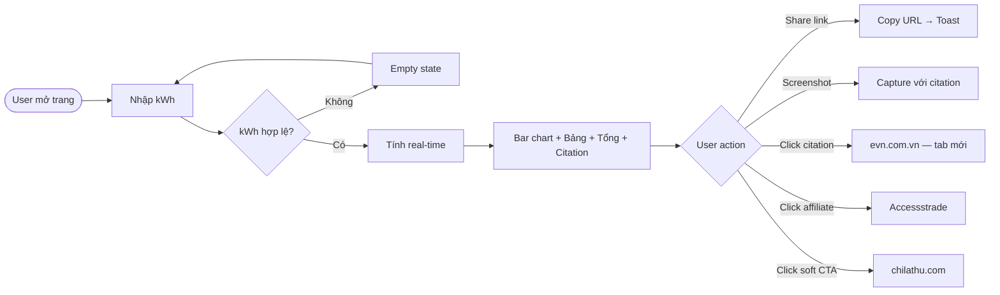

# Feature: Tính Tiền Điện EVN

> **Status:** Draft v3 — mở rộng scope toàn bộ nhóm khách hàng
> **Created:** 2026-04-18
> **URL:** `tools.chilathu.com/tinh-tien-dien`
> **Summary:** Công cụ tính tiền điện phổ quát theo QĐ 1279/QĐ-BCT 2025 — hỗ trợ tất cả nhóm khách hàng: sinh hoạt, kinh doanh (TOU), sản xuất công nghiệp (TOU), nông nghiệp, hành chính sự nghiệp. Hardcode giá từ văn bản pháp lý, không cần backend, build 1 lần dùng lâu dài.

---

## Thay đổi so với Draft v2

| Quyết định | Lý do |
|------------|-------|
| ✅ Thêm kinh doanh (TOU) | Tool phổ quát, hardcode 1 lần, không cần maintain |
| ✅ Thêm sản xuất công nghiệp (TOU) | Cùng lý do — data có sẵn từ QĐ 1279 |
| ✅ Thêm nông nghiệp, hành chính SN | Đủ nhóm khách hàng EVN |
| ✅ Thêm lại selector vùng miền | Áp dụng cho nhóm kinh doanh và sản xuất |

---

## Main Flow

1. User truy cập `tools.chilathu.com/tinh-tien-dien`
2. User chọn **nhóm khách hàng**: Sinh hoạt / Kinh doanh / Sản xuất / Nông nghiệp / Hành chính SN
3. Nếu chọn Kinh doanh hoặc Sản xuất → hiện thêm **cấp điện áp** + **selector vùng miền** (nếu có khác biệt giá)
4. User nhập kWh — sinh hoạt nhập 1 ô; TOU nhập 3 ô (thấp điểm / bình thường / cao điểm)
5. Hệ thống tính ngay (real-time) và hiển thị:
   - Visual chart phân bổ từng bậc / khung giờ
   - Bảng breakdown chi tiết
   - Tổng chưa VAT + VAT 8% + **Tổng thanh toán**
   - Source citation bên dưới kết quả
6. User share kết quả qua link hoặc capture màn hình

---

## Error Flow

| Trigger | System Response | Recovery Path |
|---------|----------------|---------------|
| kWh = 0 hoặc bỏ trống | Kết quả ẩn, hiện prompt nhẹ | User nhập lại |
| kWh âm | Field chặn ký tự `-`, không accept | Tự động |
| kWh > 9999 | Warning inline: "Số kWh này có vẻ rất lớn — kiểm tra lại nhé" | Vẫn cho tính, không block |
| kWh có chữ / ký tự đặc biệt | Chặn tại input, chỉ nhận số nguyên | Tự động |
| URL params không hợp lệ | Fallback về state mặc định (empty), không crash | Tự động |

---

## Business Rules

> Tất cả giá theo **QĐ 1279/QĐ-BCT ngày 09/5/2025**, áp dụng từ 10/5/2025, tăng 4,8% so với QĐ 2699/QĐ-BCT 2024.
> VAT 8% áp dụng cho tất cả nhóm.
> ⚠️ Các bảng giá TOU cần verify chính xác từ văn bản QĐ 1279 trước khi hardcode.

---

### 1. Sinh hoạt — 6 bậc thang, thống nhất toàn quốc, không TOU

| Bậc | kWh | Đơn giá (chưa VAT) |
|-----|-----|--------------------|
| 1 | 0 – 50 | 1.984 đ/kWh |
| 2 | 51 – 100 | 2.050 đ/kWh |
| 3 | 101 – 200 | 2.380 đ/kWh |
| 4 | 201 – 300 | 2.998 đ/kWh |
| 5 | 301 – 400 | 3.350 đ/kWh |
| 6 | > 400 | 3.460 đ/kWh |

- Không cần chọn vùng miền
- Input: 1 ô kWh duy nhất

---

### 2. Kinh doanh — TOU pricing, theo cấp điện áp

Input: kWh thấp điểm / bình thường / cao điểm (3 ô)

| Cấp điện áp | Thấp điểm | Bình thường | Cao điểm |
|-------------|-----------|-------------|----------|
| Dưới 6kV | 1.829 đ | 3.108 đ | 5.202 đ |
| 6kV – dưới 22kV | ⚠️ cần verify | ⚠️ | ⚠️ |
| 22kV – dưới 110kV | ⚠️ cần verify | ⚠️ | ⚠️ |
| Từ 110kV trở lên | ⚠️ cần verify | ⚠️ | ⚠️ |

- Cao điểm cao nhất: 5.422 đ/kWh (cần verify chính xác vs 5.202)
- Phổ biến nhất cho hộ kinh doanh nhỏ: dưới 6kV

---

### 3. Sản xuất công nghiệp — TOU pricing, theo cấp điện áp

Input: kWh thấp điểm / bình thường / cao điểm (3 ô)

| Cấp điện áp | Thấp điểm | Bình thường | Cao điểm |
|-------------|-----------|-------------|----------|
| Từ 110kV trở lên | 1.146 đ | 1.811 đ | 3.266 đ |
| 22kV – dưới 110kV | 1.037 đ | ⚠️ | 2.595 đ |
| 6kV – dưới 22kV | 1.075 đ | ⚠️ | 3.055 đ |
| Dưới 6kV | 1.133 đ | ⚠️ | 3.171 đ |

- Giá sản xuất thấp hơn kinh doanh đáng kể (ưu đãi sản xuất)
- Cấp điện áp cao hơn → giá thấp hơn (tiết kiệm chi phí truyền tải)

---

### 4. Nông nghiệp — flat rate hoặc TOU đơn giản

⚠️ Cần verify bảng giá cụ thể từ QĐ 1279. Thông thường áp dụng giá ưu đãi thấp hơn sản xuất.

---

### 5. Hành chính sự nghiệp — theo cấp điện áp, không TOU

| Cấp điện áp | Đơn giá (chưa VAT) |
|-------------|-------------------|
| Dưới 6kV | ~1.940 đ/kWh |
| 6kV trở lên | ~2.226 đ/kWh |

⚠️ Cần verify chính xác — hành chính SN (bệnh viện, trường học) thường không áp dụng TOU.

---

### Validation chung
- kWh: số dương, tối đa 5 chữ số (max 99.999 — cho hộ sản xuất lớn)
- TOU inputs: 3 ô riêng biệt, mỗi ô có thể = 0 nhưng tổng phải > 0
- Input: `type="number"` + `inputmode="numeric"`
- Cấp điện áp: dropdown, default = dưới 6kV (phổ biến nhất)

---

## Edge Cases

- **kWh đúng ngưỡng bậc (50, 100, 200...)**: Tính đúng theo cận trên, bậc tiếp theo hiện 0 kWh — vẫn render đủ 6 dòng bảng, dòng trống opacity thấp hơn
- **kWh = 401**: Bậc 6 chỉ có 1 kWh — hiển thị bình thường
- **kWh rất nhỏ (1–5 kWh)**: Tính bình thường, không có warning
- **Share link với kWh lớn**: URL params vẫn encode bình thường, không bị truncate

---

## UX & Screen States

| State | What the User Sees |
|-------|--------------------|
| Initial / Empty | Input kWh focus, placeholder "Nhập số kWh tháng này", kết quả ẩn |
| Typing (real-time) | Kết quả tính ngay khi user gõ — không cần bấm nút |
| kWh hợp lệ | Bar chart animate in + bảng breakdown + tổng tiền + source citation |
| kWh = 0 / bỏ trống | Kết quả ẩn, prompt nhẹ: "Nhập số kWh để xem kết quả" |
| kWh > 9999 | Warning inline dưới input, vẫn tính và hiện kết quả |
| Share link copied | Toast: "Đã copy link" — 2 giây tự ẩn |

---

## Output Layout (kết quả)

```
┌──────────────────────────────────────┐
│  [Bar chart ngang — 6 bậc, màu tăng dần]  │
├──────────────────────────────────────┤
│  Bậc │  kWh  │  Đơn giá  │  Thành tiền │
│   1  │   50  │  1.984đ   │   99.200đ  │
│   2  │   50  │  2.050đ   │  102.500đ  │
│   3  │  100  │  2.380đ   │  238.000đ  │
│   4  │   50  │  2.998đ   │  149.900đ  │
│   5  │    0  │  3.350đ   │       —    │  ← opacity thấp
│   6  │    0  │  3.460đ   │       —    │  ← opacity thấp
├──────────────────────────────────────┤
│  Tổng chưa VAT:       589.600đ       │
│  VAT 8%:               47.168đ       │
│  TỔNG THANH TOÁN:     636.768đ       │
├──────────────────────────────────────┤
│  📌 Nguồn: Biểu giá điện theo QĐ 1279/QĐ-BCT   │
│  ngày 09/5/2025 của Bộ Công Thương [↗]          │
│  (áp dụng từ 10/5/2025)                          │
├──────────────────────────────────────┤
│             [Logo ChilàThu]          │
└──────────────────────────────────────┘
[🔗 Share link kết quả]
```

### Source citation — yêu cầu thiết kế
- Hiển thị cuối output, trước watermark logo
- Style: nhỏ, muted — không lấn át kết quả
- Text: *"Nguồn: Biểu giá điện theo QĐ 1279/QĐ-BCT ngày 09/5/2025 — Bộ Công Thương"*
- Link: trỏ đến `evn.com.vn` hoặc văn bản chính thức, mở tab mới
- Mục đích: tăng trust, user biết số liệu lấy từ nguồn pháp lý chính thức

---

## Share Feature

**Share link** — encode state vào URL params:
```
tools.chilathu.com/tinh-tien-dien?kwh=250
```
- Mở link → auto-populate kWh + tính ngay
- Nút "Share link" copy URL vào clipboard
- Toast confirm: "Đã copy link — paste để chia sẻ"

**Capture layout** — thiết kế clean để screenshot:
- Watermark logo ChilàThu góc dưới phải
- Source citation hiện trong frame capture (không ẩn)
- Nút share có thể ẩn khi in/capture (CSS `@media print`)

---

## Accessibility Notes

- Input kWh: `type="number"`, `inputmode="numeric"` — bật numpad trên mobile
- Tap target tối thiểu 44×44px
- Bar chart: không dùng màu thuần để phân biệt bậc — thêm label số thứ tự bậc
- Bảng breakdown: có `<caption>` và `<th scope="col/row">` cho screen reader
- Source citation link: có `aria-label` rõ ràng

---

## Affiliate Placement

- **1 link duy nhất**, đặt sau output, trước soft CTA
- Nếu kWh > 300 → affiliate **thiết bị tiết kiệm điện** (Accessstrade)
- Nếu kWh ≤ 300 → affiliate **bảo hiểm nhà / thiết bị điện dân dụng**
- Soft CTA cuối trang: *"Track chi tiêu điện hàng tháng với ChilàThu ↗"*

---

## Out of Scope

- Export PDF / tạo ảnh PNG tự động
- Lưu lịch sử, so sánh tháng trước — **tool dùng 1 lần, không lưu bất kỳ dữ liệu nào**
- Giá điện bán buôn (wholesale) — chỉ tính bán lẻ

---

## Success Metrics

| Metric | Target | Tracked? | Ghi chú |
|--------|--------|----------|---------|
| Pageviews | — | Không | GA4 `page_view` |
| Tính hoàn chỉnh (kWh > 0) | > 70% sessions | Không | GA4 `calculate_complete` |
| Share link click | — | Không | GA4 `share_link_click` |
| Source citation click | — | Không | GA4 `source_click` — signal trust |
| Affiliate click | — | Không | Accessstrade pixel + GA4 `affiliate_click` |
| Bounce rate | < 60% | Không | GA4 mặc định |

---

## Flow Diagram



---

## Price Maintenance

Giá điện EVN thay đổi không định kỳ (thường 1–2 lần/năm). Vì tool hardcode giá, cần có process kiểm tra và cập nhật:

- **Trigger cập nhật**: EVN ban hành QĐ mới → dev update bảng giá trong code → redeploy Cloudflare Pages (< 5 phút)
- **Monitoring**: Scheduled task chạy mùng 1 hàng tháng lúc 9h — tự search và báo cáo nếu có QĐ mới
- **File giá tập trung**: Toàn bộ bảng giá hardcode trong 1 file `src/data/electricityRates.js` — lưu cả giá hiện tại lẫn giá kỳ trước để support tính năng so sánh

### Cấu trúc `electricityRates.js`

```js
export const rates = {
  current: {
    label: "QĐ 1279/QĐ-BCT (10/5/2025)",
    residential: [...],   // 6 bậc
    business: {...},      // TOU theo cấp điện áp
    industrial: {...},
    agricultural: [...],
    administrative: [...],
  },
  previous: {
    label: "QĐ 2699/QĐ-BCT (11/10/2024)",  // ví dụ
    residential: [...],
    // ...
  }
}
```

Khi có QĐ mới: `current` → `previous`, thêm `current` mới. Chỉ giữ 1 kỳ trước — không cần lịch sử dài.

---

## Feature: So sánh giá cũ / mới

Khi file `electricityRates.js` có cả `current` và `previous`, UI hiện thêm banner thông báo + toggle so sánh.

### Banner thông báo (hiện phía trên kết quả)

```
┌─────────────────────────────────────────┐
│ 🔔 Giá điện vừa được điều chỉnh         │
│ QĐ 1279/QĐ-BCT áp dụng từ 10/5/2025    │
│ Tăng 4,8% so với kỳ trước  [So sánh ↕] │
└─────────────────────────────────────────┘
```

- Style: amber tint (`#fffbeb`, border `#fde68a`) — thông báo nhẹ, không alarming
- Chỉ hiện khi có `previous` trong data
- Có nút "Đóng" — ẩn banner trong session (không lưu localStorage)

### Toggle so sánh giá

Khi user bấm "So sánh ↕", output chuyển sang chế độ song song:

```
         [ Giá cũ ] ←toggle→ [ Giá mới ]  (hoặc hiện cả 2 cột)

Bậc │ kWh │ Giá cũ (QĐ 2699) │ Giá mới (QĐ 1279) │ Chênh lệch
  1 │  50 │    1.893đ         │    1.984đ          │  +91đ (+4,8%)
  2 │  50 │    1.956đ         │    2.050đ          │  +94đ (+4,8%)
  ...

Tổng cũ: 580.000đ   →   Tổng mới: 607.000đ   (+27.000đ)
```

- Chênh lệch hiện màu đỏ nhạt nếu tăng, xanh nhạt nếu giảm
- Toggle dạng pill: `[Giá hiện tại]` / `[So sánh với kỳ trước]`
- Mặc định luôn hiện giá hiện tại — so sánh là optional

---

## Open Questions

1. **Bảng giá TOU còn thiếu**: Kinh doanh cấp 6kV+, sản xuất giờ bình thường, nông nghiệp — cần lấy từ văn bản QĐ 1279 đầy đủ trước khi build
2. **UX TOU input**: 3 ô nhập kWh theo giờ — cần mockup để confirm trước khi code
